# Functions in C

---

## Key Terminology

Before diving into functions, the following terms must be understood:

|Term|Meaning|
|---|---|
|**Declaration**|Telling the compiler a function exists (name, return type, parameters)|
|**Definition**|The actual implementation — the full function body|
|**Prototype**|Another name for a function declaration|
|**Body**|The block of code inside `{ }` that the function executes|
|**Arguments**|The values passed into a function when calling it|
|**Return**|The value the function sends back to the caller|
|**Call**|The act of invoking a function from another location in code|

---

## What is a Function?

In C, a **function** is a separate, standalone unit of code — independent from the rest of the program.

### Why Use Functions?

When a piece of code is **repeated many times** throughout a project, instead of copying it, you write it once as a function and **call it** whenever needed.

> The process of leaving the current code, jumping to a function after calling it, executing it, and then **returning back** to the original code is called **Context Switching**.

---

## Function Syntax

```c
returnType functionName(parameters)
{
    // function body — the code that executes when called
}
```

A **prototype** consists of:

1. Return type (before the function name)
2. Function name
3. `()` — input parameters

### Complete Example

```c
int Add(int a, int b)   // prototype: return type = int, name = Add, args = a and b
{
    int result;          // local variable — only exists inside this function
    result = a + b;
    return result;       // sends the computed value back to the caller
}

int main()              // main() is the CALLER; Add() is the CALLEE
{
    int x;
    x = Add(10, 11);    // function call — passes 10 and 11 as arguments
}
```

---

## Important Function Rules

### 1. Argument Count Must Match

You **must** pass exactly the number of arguments the function declares:

```c
int Add(int x, int y) { }

int main()
{
    Add(3, 4, 5);   // compilation error — too many arguments
    Add(3);         // compilation error — too few arguments
}
```

---

### 2. Multi-Argument Functions (Variadic) — Exception to Rule 1

There is a special type of function that accepts a **variable number of arguments**, using the ellipsis operator `...`:

```c
func(...)   // ellipsis operator — can receive any number of arguments
func()      // empty parentheses — also accepts any number of arguments (dangerous)
```

> **Note:** Multi-argument (variadic) functions are **not recommended**. Their use is very rare and considered one of C's drawbacks.
> 
> **Security Risk:** Hackers can exploit variadic functions by flooding them with millions of arguments, potentially crashing the system or corrupting memory.

#### Real-World Example — `printf`

```c
printf("Youssef");
printf("Youssef %d", x);
printf("Youssef %d %d", x, y);
// All of the above work because printf is implemented as a variadic function.
// More details will come later.
```

---

### 3. `void func()` vs `void func(void)` — Critical Difference

This is a **very frequently asked interview question**:

```c
void func()       // accepts ANY number of arguments — risky (multi-argument behavior)
void func(void)   // accepts NO arguments — throws a compilation error if arguments are passed
```

> ⚠️ `void func()` **≠** `void func(void)` — these are **not the same**.

**C Standard note:**

- Up to **C11**: `func()` with empty parentheses passes through the compiler without error.
- From **C23**: `func()` with empty parentheses will **throw a compilation error** — it is now formally deprecated.

---

## Return Values

```c
void add(int a, int b)     // returns nothing
{

}

void print_data(void)      // returns nothing, takes nothing
{

}

int main(void)
{
    int res = add(3, 4);   // normal usage — capturing the return value

    add(3, 4);             // also valid in C — ignoring the return value is allowed

    printf("x");           // printf returns the character count, but we ignore it — perfectly fine

    print_data();          // correct call
    // print_data(5);      // error — this function takes void, no arguments allowed
    // int x = print_data(); // error — this function returns void, nothing to capture
}
```

> In C, there is **nothing preventing you from ignoring a return value** — it is always valid to call a function and discard its result.

---

## Function Declaration vs. Definition

A function **must be declared or defined before it is called**.

```c
// Option A — define the function BEFORE main (simple but not clean code style)
int func()
{
    // body
}

int main(void)
{
    func();   // works because func is already defined above
}
```

The **clean code convention** is to keep `main()` at the top of the `.c` file. To achieve this, use a **function declaration (prototype)** before `main`, and place the full definition afterward:

```c
int func();    // function declaration (prototype) — tells the compiler func exists

int main(void)
{
    func();    // valid — compiler already knows about func from the declaration
}

int func()     // function definition — can now appear after main
{
    // body
}
```

---

## The Story of a Function Call

```c
int main(void)
{
    int x = func(4, 5);
    // What happens from this line until the program returns to the next line?
}
```

### Calling Context Switching (main → func)

When `func(4, 5)` is called at address `1000`:

1. **Save the return address** (`1001`) into RAM
2. **Push arguments** (`4` and `5`) onto the stack
3. **Jump to the function's address** — `PC = 2000` (where `func` is defined in Flash)

### Return Context Switching (func → main)

When `func` finishes execution:

1. **Push the return value** onto the stack
2. **Pop (clean up)** the function's data from the stack
3. **Return to the saved address** — `PC = 1001` (resume main)

#### Memory Layout

|Memory|Address|Contents|
|---|---|---|
|**Flash**|`1000`|`func(4, 5)` — the call instruction|
|**Flash**|`1001`|next instruction in `main`|
|**Flash**|`2000`|`func` definition (function code)|
|**RAM (stack)**|—|return address: `1001`|
|**RAM (stack)**|—|argument: `4`|
|**RAM (stack)**|—|argument: `5`|
|**RAM (stack)**|—|return value: `20`|


---

## Review Questions

### Q1 — What is the difference between a function definition and a declaration?

||Declaration|Definition|
|---|---|---|
|Contains body?|No|Yes|
|Ends with `;`?|Yes|No|
|Purpose|Tells compiler the function exists|Provides the actual implementation|

---

### Q2 — Does calling a `void func(void)` (no parameters, no return) impact the stack?

**Answer: TRUE — it does impact the stack.**

Even if the function takes `void` and returns `void` and has **no local variables**, calling it will still **push the return address onto the stack**. The stack is always touched on any function call.

---

### Q3 — Does calling context switching follow the same steps as returning context switching?

**Answer: FALSE.**

|Phase|Steps|
|---|---|
|**Calling** (context switch in)|Save return address → push arguments → jump to function|
|**Returning** (context switch out)|Push return value → pop/clean up stack → jump back to saved address|

The two phases are **not symmetrical** — calling _saves_ information, returning _deletes_ it.

---

### Q4 — Are these equivalent?

```c
void func(void) == void func()   // FALSE
```

- `void func(void)` → accepts **no** arguments (enforced)
- `void func()` → accepts **any** arguments (dangerous, multi-argument behavior)

---

### Q5 — Are nested functions allowed in C?

```c
void main(void)
{
    void func(void)   // ERROR — nested function definition
    {
        // some code
    }
    func();
}
```

**Answer: No — this is a compilation error.**

In C, functions **must be standalone**. Defining a function inside another function (nested functions) is **not allowed** by the C standard.

---
